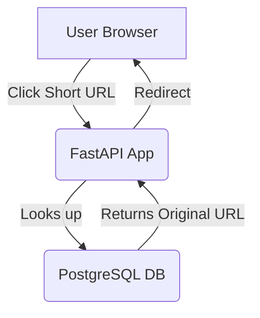

# 🚀 Project Overview – URL Shortener

## 🧠 What is this?

This project is a **URL Shortener**, like [bit.ly](https://bit.ly) or \[tinyurl.com], built using **FastAPI** + **PostgreSQL**, fully containerized with **Docker**, and designed to be production-ready with **DevOps practices** like CI/CD, Infrastructure-as-Code, and Monitoring.

---

## 🔗 What Does It Do?

It lets users:

* 🎯 Submit a long URL
  → Get back a short one like `http://localhost:8000/abc123`
* ⟲ Open the short URL
  → Instantly redirect to the original long link

---

## 👶 A Fresher’s Perspective: What I’m Learning

| Layer                   | Tool                       | What I’m Learning                                  |
| ----------------------- | -------------------------- | -------------------------------------------------- |
| 🧠 Backend              | **FastAPI**                | How to create APIs and routes in Python            |
| 📂 Database             | **PostgreSQL**             | How to store data like `short ↔ long` URL mappings |
| ⚙️ Containerization     | **Docker**                 | How to run apps consistently across systems        |
| ⚡ Compose               | **docker-compose**         | How to run multiple services (App + DB) together   |
| 🔐 Migrations           | **Alembic**                | How to safely manage DB schema changes             |
| 🔐 Security             | **.env + configs**         | How to handle secrets and configs securely         |
| ☁️ CI/CD (Coming Soon)  | **GitHub Actions**         | Auto-building, testing, and deploying code         |
| 🌍 Infra (Planned)      | **Terraform + Kubernetes** | How to run in real cloud infra                     |
| 📊 Monitoring (Planned) | **Prometheus + Grafana**   | Keep visibility on app health and usage            |

---

## 🗘️ Mental Map: How Everything Connects



And here’s how the **DevOps side** wraps around it:

```
Source Code (FastAPI + DB Models)
        ↓
Dockerfile + docker-compose.yml
        ↓
Docker builds 2 containers: App + DB
        ↓
`docker-compose up -d` runs them together
        ↓
Localhost:8000 is live and functional!
```

---

## 🛠️ Technologies Used

* **Backend**: FastAPI, Uvicorn
* **Database**: PostgreSQL
* **ORM & Migrations**: SQLAlchemy, Alembic
* **Containerization**: Docker, docker-compose
* **DevOps (Planned)**: GitHub Actions, Terraform, Kubernetes, Prometheus, Grafana
